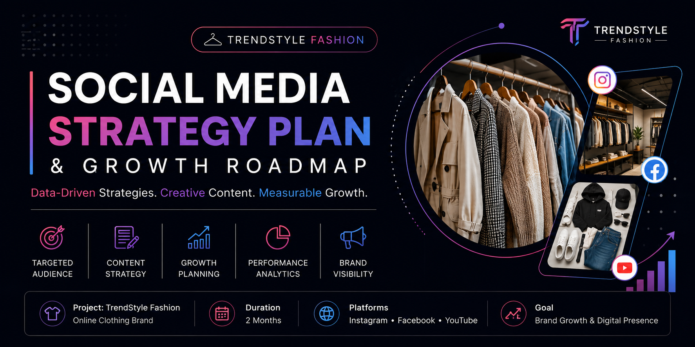
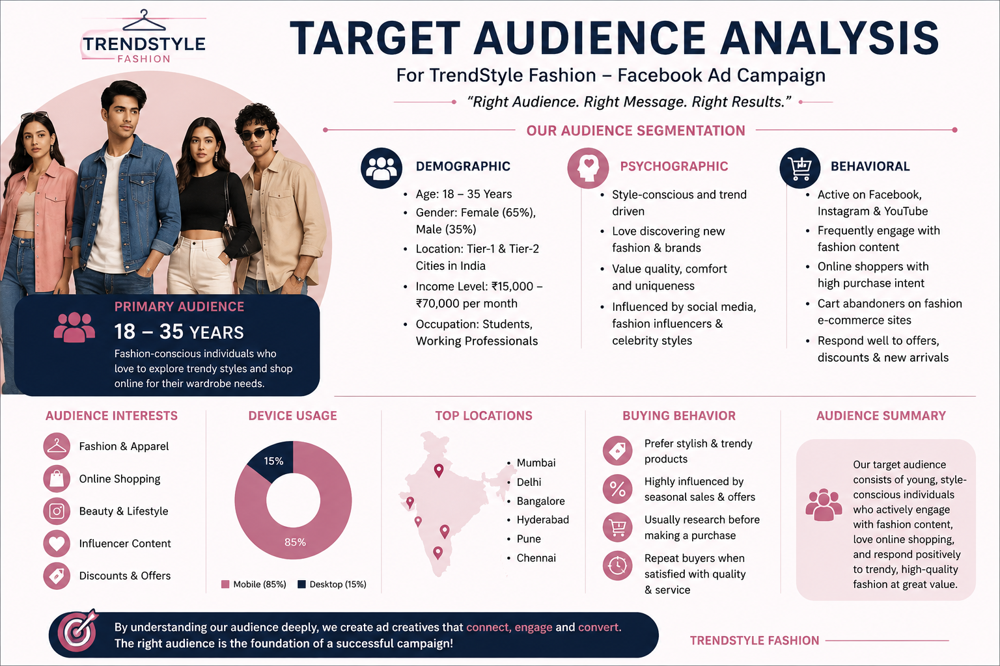
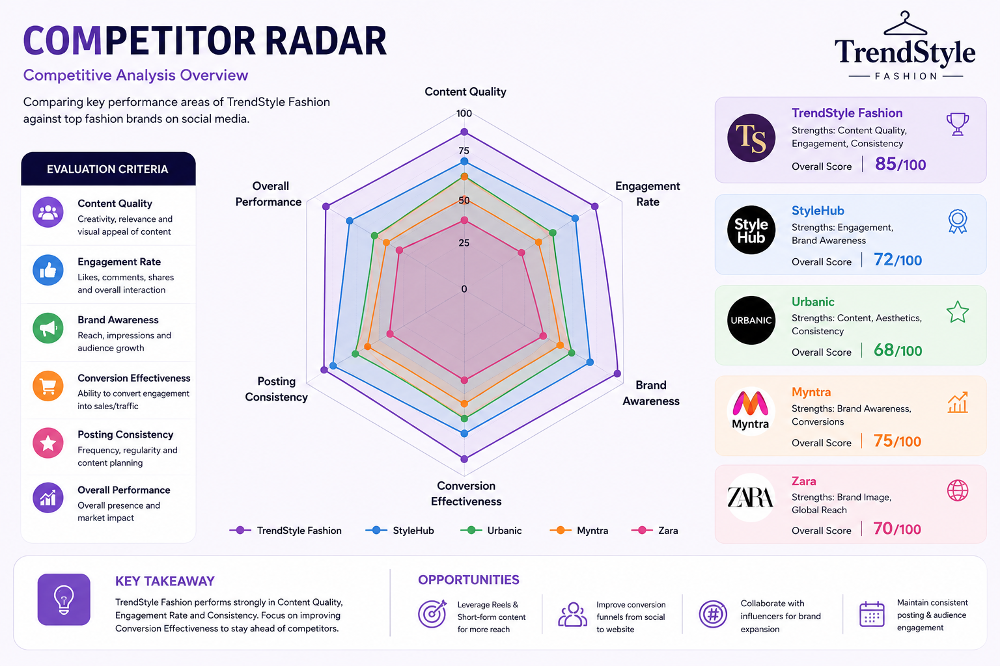
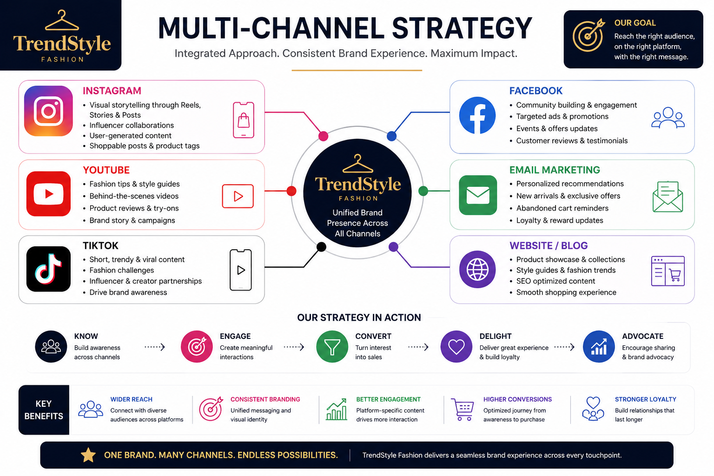
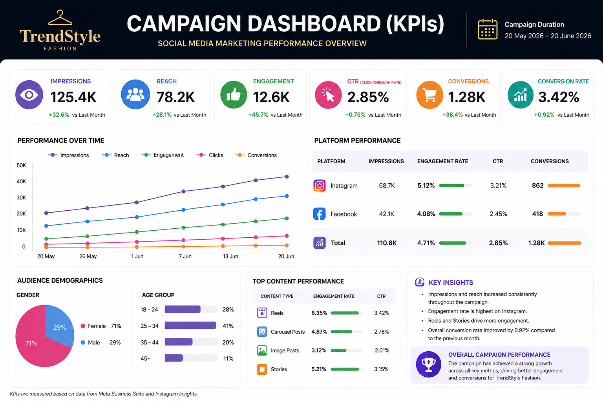

# 🚀 Advanced Social Media Strategy Plan & Growth Roadmap

---

## 🧑‍💻 Internship & Candidate Profile
* **Intern Name:** Yeturi Nithya Niranjani
* **Intern ID:** CITS1133
* **Internship Domain:** Digital Marketing
* **Organization:** CODTECH IT Solutions Private Limited 
* **Project Reference:** Task 1 - Social Media Strategy Plan
* **Project Target Brand:** TrendStyle Fashion (Online Clothing Brand)

---

## 📌 1. Introduction
Social media marketing is one of the most effective ways for businesses to connect with customers, increase brand awareness, and promote products. This project develops a comprehensive, data-driven social media strategy plan for **TrendStyle Fashion**, an online fashion brand targeting young adults. The strategy focuses on creating engaging content, improving customer interaction, and increasing online visibility over a multi-week rolling framework by combining organic growth with algorithmic optimization.

---

## 🎯 2. Core Strategic Objectives
* **Increase Brand Awareness:** Scale organic reach and positioning within competitive digital markets.
* **Gain New Followers:** Drive high-velocity, sustainable follower growth across core target segments.
* **Improve Customer Engagement:** Shift metrics from passive scrolling to active, meaningful brand conversations.
* **Promote Products Effectively:** Showcase new arrivals and seasonal collections using interactive visual formats.
* **Increase Website Traffic & Sales:** Optimize bio links and call-to-actions to drive direct store conversions.

---

## 👥 3. Target Audience Matrix & Market Segmentation
| Category | Targeted Details |
| :--- | :--- |
| **Age Group** | 18–30 Years (Gen-Z & Millennials) |
| **Gender** | Male & Female |
| **Location** | India (Tier-1 & Tier-2 Cities via Digital Reach) |
| **Interests** | Sustainable Fashion, Online Shopping, Streetwear, Lifestyle, Modern Trends |
| **Buying Behavior** | High mobile usage, discount-driven, influenced by short-form video content (Reels/Shorts) |

  

<i>Figure 1: Target Audience Analysis</i>

---

## ⚔️ 4. Competitor Analysis & Benchmarking
To position **TrendStyle Fashion** effectively, we continuously benchmark against leading fast-fashion and e-commerce brands (e.g., Westside, Myntra, H&M) focusing on:
* **Content Gaps:** Identifying underutilized content buckets like detailed fabric-breakdown videos.
* **Hashtag Strategy:** Auditing high-volume, niche, and location-specific fashion hashtags.
* **Engagement Tactics:** Analyzing competitor response times and interactive community stories.

  

<i>Figure 2: Competitor Analysis Radar</i>

---

## 📱 5. Multi-Platform Distribution Architecture

### 📸 Instagram (Visual Discovery & High Reach)
* High-Velocity Vertical Reels for organic discovery and viral potential.
* Interactive Daily Stories (Polls, Q&As, Countdowns) for engagement.
* High-Quality Product Grid Posts, Aesthetic Lookbooks, and Customer Testimonials.

### 👥 Facebook (Community & Long-Form Trust)
* Promotional Posts, detailed product catalogs, and targeted group interactions.
* Exclusive Festival/Seasonal Offers and early-access announcements.
* Nurturing localized micro-communities and handling customer support.

### 🎥 YouTube (Search Authority & Video Content)
* Fashion Tips, DIY Styling Video Guides, and "Haul" videos.
* Authentic Product Reviews and engaging YouTube Shorts (Value Bombs).

  

<i>Figure 3: Multi-Channel Distribution Strategy</i>

---

## 🧠 6. Content Strategy Framework
* **Educational Content:** Practical fashion tips, body-type style guides, and seasonal trend updates.
* **Promotional Content:** New product collection launches, exclusive discount codes, and seasonal flash sales.
* **Engagement Content:** Interactive audience polls, interactive quizzes, and weekly Q&A sessions.
* **User Generated Content (UGC):** Sharing authentic customer reviews, client photos, and unboxing video testimonials.

---

## 📅 7. Weekly Content Calendar (Rolling Execution Loop)
| Day | Content Strategy & Format | Core Objective |
| :--- | :--- | :--- |
| **Monday** | New Collection Launch (High-Quality Product Grid) | Brand Awareness & Desire |
| **Tuesday** | Customer Review Post (Social Proof Showcase) | Building Trust & Credibility |
| **Wednesday** | Fashion Tips Reel (Educational Value Drop) | Algorithmic Organic Reach |
| **Thursday** | Product Showcase (Deep Dive into Fabric & Styling) | Product Education |
| **Friday** | Discount Offer (Weekend Flash Sale Trigger) | Direct Conversion & Sales |
| **Saturday** | Behind The Scenes (Brand Transparency & Connection) | Humanizing the Brand |
| **Sunday** | Interactive Poll & Audience Q&A Session | Community Engagement |

---

## 💰 8. Strategic Budget Allocation (Fictional Framework)
To accelerate growth alongside organic efforts, a balanced paid marketing budget is planned:
* **60% Instagram/Facebook Ads:** Directed toward lookalike audiences and interest-based targeting (Fashion/Shopping).
* **20% Remarketing Campaigns:** Targeting users who visited the website or abandoned their shopping carts.
* **20% Influencer Collaborations:** Partnering with micro-influencers (10k-50k followers) for authentic content creation.

---

## 🛠️ 9. Modern Marketing Tools Utilized
* **Canva:** Visual asset design, high-impact template creation, and banner crafting.
* **ChatGPT:** Copywriting optimization, caption generation, and content ideation.
* **Google Trends:** Keyword analytics and real-time viral fashion topic tracking.
* **Instagram Insights & Facebook Business Suite:** Data-driven KPI monitoring and metric audits.

---

## 📈 10. Expected Data Outcomes & Key Performance Indicators (KPIs)
* Achieving a projected **20% increase in followers during the implementation period.
* **Click-Through Rate (CTR):** Elevating the volume of traffic routing directly from social biographies to primary landing pages.
* **Higher Engagement Rate:** Measurable increases in likes, comments, and profile saves (Algorithmic Trust).
* **Customer Acquisition Cost (CAC):** Optimizing paid campaign structures to reduce overall acquisition costs.

  

<i>Figure 4: Campaign Performance Dashboard (KPIs)</i>

---

## 💡 11. Conclusion
A well-structured, metrics-driven social media strategy plan bridges the operational gap between organizations and their core target demographics. Through consistent content execution, active budget optimization, and continuous performance auditing, **TrendStyle Fashion** can successfully establish robust digital growth, cultivate brand recognition, and ensure sustainable market affinity.

---

## 📚 12. References
* Google Trends 
* Meta Business Suite Documentation
* Canva Design Resources 
* Digital Marketing Fundamentals 

---

## 🏷️ 13. Strategic Hashtag Bank (TrendStyle Optimization)
To maximize the organic discoverability of our reels and posts, the following multi-tier hashtag framework is implemented:
* **Brand Specific:** `#TrendStyleFashion` `#TrendStyleVibes` `#ShopTrendStyle`
* **Niche & Category Focus:** `#IndianFashionBrand` `#StreetwearIndia` `#GenZFashion` `#ModernOutfits` `#AestheticLookbook`
* **High-Volume Algorithmic Push:** `#FashionReels` `#OOTDIndia` `#DigitalMarketingFashion` `#ExplorePage` `#TrendingOutfits`

---

## ✍️ 14. Sample Ad Copy & Content Caption Showcase
Here is a live production-ready copywriting sample designed for the Monday "New Collection Launch":

> **⚡ Primary Caption:**
> "Ready to upgrade your wardrobe game? 🌟 **TrendStyle Fashion** officially drops its premium Gen-Z & Millennial collection this Monday! Fresh structural cuts, sustainable premium fabrics, and styles that turn heads instantly. 🛍️  
>   
> **💥 Limited Launch Offer:** Use code **TREND20** for a flat 20% OFF on your first purchase!  
> 🔗 Click the link in our bio to shop the drop now!  
>   
> #TrendStyleFashion #NewArrivals #GenZFashion #OOTDIndia #ExplorePage"

